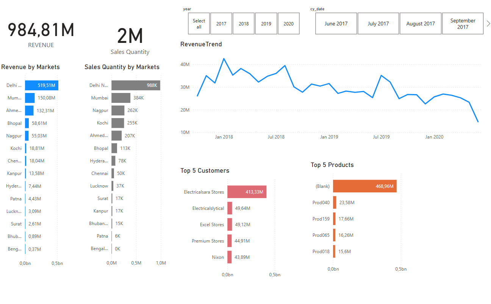

# SQL and Power BI Project - Insight of Sales

## 📊 Project Overview

This project provides a detailed **Sales Insight Dashboard** for **Atlic Hardware**, utilizing **SQL** for data cleaning and **Power BI** for data transformation, modeling, and visualization. It offers business insights into total revenue, customer behavior, product trends, and regional sales performance.

---

## 🔧 Tools and Technologies Used

- **SQL**: Data cleaning and preparation
- **Power BI**:
  - Extract, Transform, Load (ETL)
  - Data modeling using Star Schema
  - Building interactive dashboards and mobile layout support

---

## 🗂️ Data Source

- **Dataset**: Atlic Hardware (sales-related data)
- Includes tables such as: `Sales`, `Customers`, `Products`, `Regions`, `Dates`

---

## ⚙️ Data Preparation

### SQL (Data Cleaning)
- Handled missing and inconsistent values
- Removed duplicates
- Normalized data formats (e.g., dates, currency)

### Power BI (ETL)
- Imported cleaned data into Power BI
- Performed further transformations using Power Query Editor
- Created relationships between tables following a **Star Schema**

---

## 🧠 Key Insights from Dashboard

- ✅ **Total Revenue** generated across all regions
- 📦 **Total Quantity Sold**
- 🥇 **Top Customers** by revenue contribution
- 🌍 **Top Performing Regions**
- 📈 **Revenue Trends** over time
- 📱 **Mobile-Friendly Layout** for on-the-go insights

---

## 🖼️ Dashboard Snapshot



---

## 📁 File Structure

```
project-folder/
│
├── README.md
├── atlic_sales.sql           # SQL script for data cleaning
├── Atlic_Sales_Insights.pbix # Power BI dashboard file
└── data/
    └── raw_data.csv          # Original dataset (if shareable)
```

---

## 🚀 How to Use

1. Clone this repository or download the ZIP.
2. Open `atlic_sales.sql` in your SQL environment to clean and prepare the data.
3. Open `insight of sales.pbix` in Power BI Desktop.
4. Refresh the data and explore the interactive dashboard.

---
Main file to see the final outcome: insight of sales.pbix
